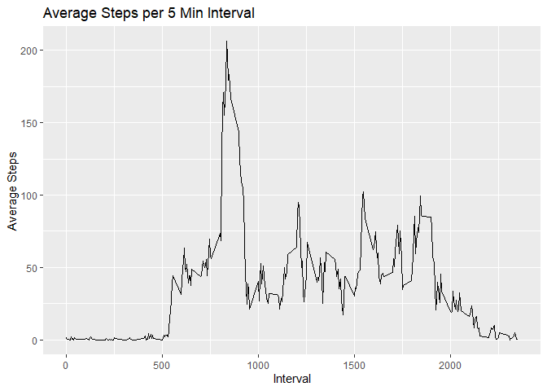

Import the libraries we’ll use throughout the analysis

    library(dplyr)
    library(ggplot2)

We would like to analyze movement data from a personal activity
monitoring device. The data we will be analyzing includes step counts
for each 5 minute interval over a period of several weeks.

First import the data from the link provided with the assignment. Assign
it to the variable df.

    temp <- tempfile()
    download.file("https://d396qusza40orc.cloudfront.net/repdata%2Fdata%2Factivity.zip",temp)
    df <- read.csv(unz(temp, "activity.csv"))
    unlink(temp)

Aggregate the data at the daily level and find the total number of steps
taken each day.

    dfDate = df %>% group_by(date) %>%
        summarize(
        sumSteps = sum(steps, na.rm = TRUE)
    )

Plot a histogram of the steps taken per day.

    ggplot(dfDate, aes(x=sumSteps)) + 
        geom_histogram() +
        ggtitle("Daily Steps Histogram") +
        xlab("Daily Steps")

    ## `stat_bin()` using `bins = 30`. Pick better value with `binwidth`.

Find the mean and median number of steps taken per day

    mean(dfDate$sumSteps, na.rm = TRUE)

    ## [1] 9354.23

    median(dfDate$sumSteps, na.rm = TRUE)

    ## [1] 10395

Next, we want to analyze the average movement throughout the day. First
we’ll find the number of steps taken in each 5-min interval, averaged
out across all days in the sample.

    dfInt = df %>% group_by(interval) %>%
        summarize(
            avgSteps = mean(steps, na.rm = TRUE)
        )

Next we’ll plot activity throughout an average day.

    ggplot(dfInt, aes(x = interval, y = avgSteps)) +
        geom_line() +
        ggtitle("Average Steps per 5 Min Interval") +
        xlab("Interval") +
        ylab("Average Steps")

We’ll look at which interval contains the highest average step count.

    dfInt[dfInt$avgSteps == max(dfInt$avgSteps), 1]

    ## # A tibble: 1 x 1
    ##   interval
    ##      <int>
    ## 1      835

We’d like to impute the missing values in the dataset. First, we’ll take
a look at how many rows of the dataset are missing values.

    sum(!complete.cases(df))

    ## [1] 2304

Next we’ll merge our primary dataframe with the one we just created in
order to impute missing values using the average value from the
corresponding time interval. The copy of the dataframe with the missing
values filled in will be called dfImputed.

    dfMerge <- merge(df[!complete.cases(df), ], dfInt, by = "interval", sort = FALSE)
    dfMerge <- dfMerge[order(dfMerge$date, dfMerge$interval),]

    dfImputed <- data.frame(df)
    dfImputed[!complete.cases(dfImputed), ]$steps <- dfMerge$avgSteps

We’d like to see if imputing missing values has affected our
steps-per-day analysis. First we’ll recreate our dataframe aggregated at
the date level and plot the histogram of steps per day.

    dfImputedDate = dfImputed %>% group_by(date) %>%
        summarize(
            sumSteps = sum(steps, na.rm = TRUE)
        )

    ggplot(dfImputedDate, aes(x=sumSteps)) + 
        geom_histogram() +
        ggtitle("Daily Steps  - Missing Values Imputed") +
        xlab("Daily Steps")

Next we’ll look at the median and mean

    mean(dfImputedDate$sumSteps, na.rm = TRUE)

    ## [1] 10766.19

    median(dfImputedDate$sumSteps, na.rm = TRUE)

    ## [1] 10766.19

As we can see, the median and mean have both increased. This is because
missing values caused some dates to have a low number of steps. Filling
in those missing values pushed those daily totals higher.

Finally, we’d like to check to see whether activity patterns differ
between weekdays and weekends. First we’ll add a variable indicating
whether each day is a weekday or weekend.

    dfImputed$date <- as.Date(dfImputed$date, format = "%Y-%m-%d")
    dfImputed$dayType <- factor(NA, levels = c("weekday","weekend"))

    weekdayList = c("Monday", "Tuesday", "Wednesday", "Thursday", "Friday")
    weekendList = c("Saturday", "Sunday")
    dfImputed[weekdays(dfImputed$date) %in% weekdayList, "dayType"]<- "weekday"
    dfImputed[weekdays(dfImputed$date) %in% weekendList, "dayType"]<- "weekend"

Once again we want to aggregate our data to find average steps per
5-minute interval. However, this time we need to include our new dayType
variable in the grouping so that we can compare weekdays and weekends.

Next we’ll plot the daily activity patterns for each dayType.

    dfImputedInt = dfImputed %>% group_by(interval, dayType) %>%
        summarize(
            avgSteps = mean(steps, na.rm = TRUE)
        )

    ggplot(dfImputedInt, aes(x = interval, y = avgSteps)) +
        geom_line() +
        ggtitle("Average Steps per 5 Min Interval") +
        xlab("Interval") +
        ylab("Average Steps") +
        facet_wrap(dayType ~ .) 

